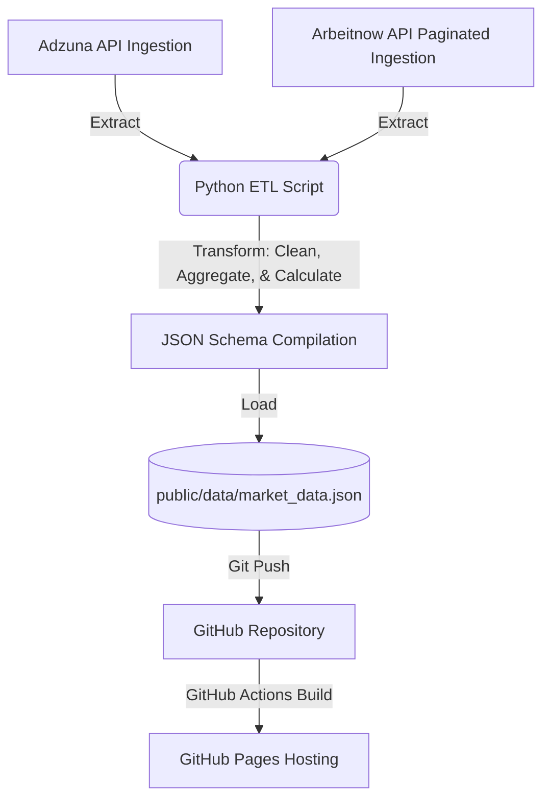

# 🌍 EU Job Market Pulse

[](https://charu7san.github.io/eu-job-market-pulse/)

An automated **ETL (Extract, Transform, Load) pipeline** and interactive **analytics dashboard** tracking technology job trends across European markets. Built using real-time API integrations, this project transforms fragmented job board data into actionable market insights.

**🔗 Live Demo:** [https://charu7san.github.io/eu-job-market-pulse/](https://charu7san.github.io/eu-job-market-pulse/)

---

## 🎯 Business Value & Analytical Insights
In a fragmented job market, recruiters and job seekers struggle to identify hiring trends across different countries. This dashboard answers critical business questions:
*   **Skill Demand Analysis:** Which technical skills (e.g., Python, SQL, React, Snowflake) are currently dominating the tech landscape?
*   **Salary Benchmarking:** How do average salaries compare between different EU nations, and where are the highest-paying regions?
*   **Remote Work Adoption:** Which countries are leading in remote-friendly work opportunities, and what percentage of roles offer flexible arrangements?
*   **Geographic Clustering:** Which specific cities are active tech hubs within each country?

---

## ⚙️ ETL Pipeline & Data Architecture
The data infrastructure is fully automated, self-sustaining, and runs on a **$0 budget** using GitHub Actions:



### 1. Extract
*   **API Integrations:** Ingests live data from the **Adzuna API** (for regional aggregates) and the **Arbeitnow API** (for remote tech roles).
*   **Pagination:** Handles paginated API responses by programmatically traversing `next` page links until all records are collected.
*   **Defensive Ingestion:** Implements request timeouts (`timeout=10`) and polite API rate-limiting delays (`time.sleep()`) to ensure reliable data fetching.

### 2. Transform (Data Wrangling)
*   **Average Salary Fallbacks:** If the primary average salary field is missing or zero, the script dynamically parses the page's search results and averages the minimum and maximum ranges to estimate a realistic benchmark.
*   **Skill Aggregation:** Normalizes and maps raw text/tags from job postings against a target list of 20+ key tech skills.
*   **Geographic Normalization:** Filters out virtual sources (like global remote boards) from country-specific maps while rolling them into global market aggregates.

### 3. Load
*   **JSON Schema:** Compiles all transformed metrics into a single structured JSON schema file. This file functions as a high-performance, static data backend.

---

## 🛠️ Tech Stack & Skills Highlighted

### **Data Analyst & ETL Competencies**
*   **API Engineering:** Nested JSON parsing, paginated API traversal, and token authentication.
*   **Data Wrangling & Cleaning:** Writing robust error-handling logic (try-except blocks, timeouts, and fallbacks) to maintain data integrity when external APIs return incomplete or malformed data.
*   **Data Aggregation:** Designing metrics, computing remote ratios, and clustering data by countries and skills.

### **Tech Stack**
*   **Python:** Ingestion logic (`requests`, `json`, `time`, `datetime`).
*   **React & Vite:** A high-speed, modern frontend architecture.
*   **Recharts:** Interactive, responsive visualizations (bar charts, line graphs, geo charts).
*   **Tailwind CSS v4:** Modern styling for responsive and sleek dashboards.
*   **GitHub Actions:** Automated scheduling (Daily Cron at midnight) and automated git commit-and-push pipelines.

---

## 🛠️ Local Installation & Development

### 1. Environment Configuration
Create a `.env` file in the root directory:
```env
ADZUNA_APP_ID=your_app_id
ADZUNA_APP_KEY=your_app_key
```

### 2. Run the ETL Pipeline
```bash
# Install Python dependencies
pip install -r requirements.txt

# Run the ETL script locally to generate market_data.json
python script.py
```

### 3. Start the Analytics Dashboard
```bash
# Install Node.js dependencies
npm install

# Start the local development server
npm run dev
```

---

## 📈 Recruiting Contact
This project demonstrates the ability to take raw, messy API feeds, engineer a reliable ETL pipeline, and present the final insights in an executive-ready dashboard. 

*Interested in discussing data engineering, analytics pipelines, or frontend business intelligence? Let's connect!*
